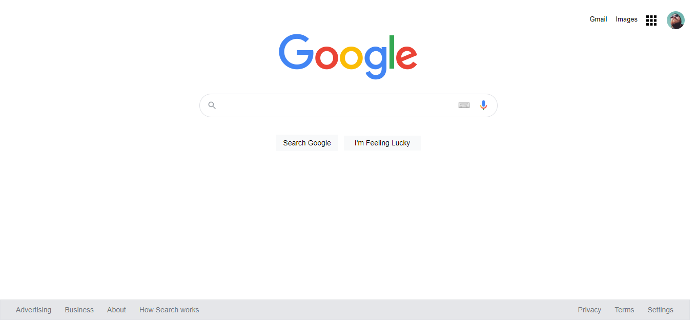

# Kodluyoruz frontend css 2.ödevi - Google web sayfası
-Hazır verilmiş kaynak kod ile ilgili düzenlemeleri yaparak sayfayı olması gereken yapıya getirdim.
***
-İlk Hali

***
-Son Hali

[patika.dev](https://www.patika.dev/tr)